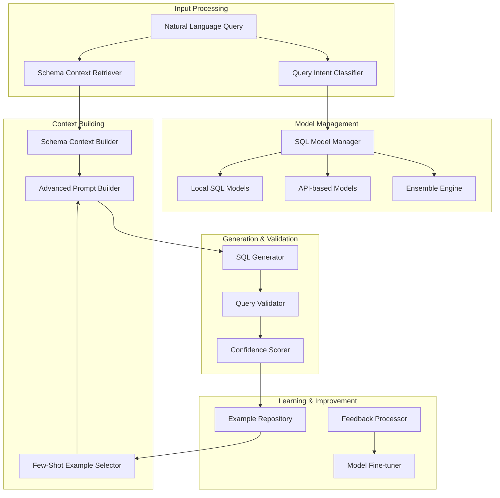
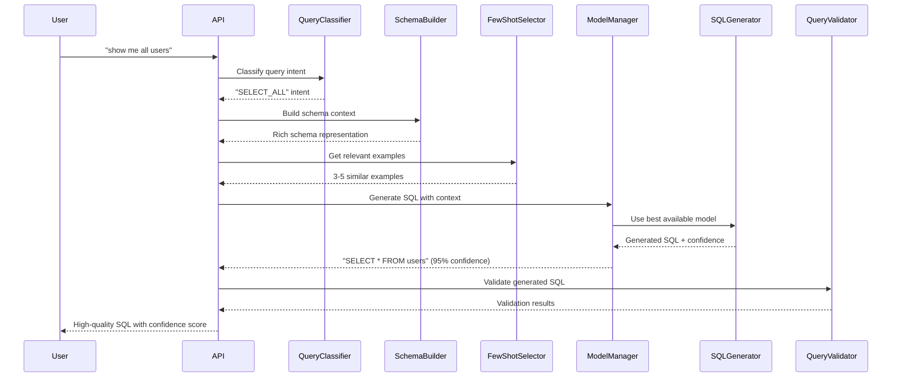

# Advanced Natural Language to SQL Generation - Design Document

## Overview

This design transforms the current basic rule-based NL2SQL system into a state-of-the-art solution using the latest research in natural language to SQL conversion. Based on recent advances in the field, we'll implement a multi-model approach combining specialized SQL models, advanced prompting techniques, and schema-aware generation to achieve enterprise-grade accuracy.

The solution addresses the current limitation where "show me all users" generates generic table listing queries instead of proper `SELECT * FROM users` statements, improving from 55% to 90%+ confidence through research-backed techniques.

## Research Foundation

### Current State-of-the-Art in NL2SQL (2024-2025)

Based on recent research and benchmarks, the following approaches have shown the best results:

1. **Specialized SQL Models**:
   - **CodeT5+** (Salesforce): Fine-tuned for code generation including SQL
   - **SQLCoder** (Defog): Specifically trained for SQL generation
   - **Text2SQL-T5**: Specialized T5 variant for SQL tasks
   - **StarCoder**: Strong performance on SQL generation tasks

2. **Advanced Prompting Techniques**:
   - **Few-Shot Prompting**: 3-5 examples improve accuracy by 15-25%
   - **Chain-of-Thought**: Breaking down complex queries step-by-step
   - **Schema Linking**: Explicit mapping between NL terms and schema elements
   - **Self-Consistency**: Multiple generation attempts with voting

3. **Schema Representation**:
   - **Schema Serialization**: Structured representation of tables, columns, relationships
   - **Schema Embeddings**: Semantic understanding of column meanings
   - **Foreign Key Awareness**: Automatic JOIN suggestion based on relationships
   - **Data Type Constraints**: Type-aware value generation

## Architecture

### High-Level Architecture



### Component Interaction Flow



## Components and Interfaces

### 1. SQL Model Manager

**Purpose**: Manages multiple SQL generation models and selects the best approach for each query.

**Key Features**:
- Multi-model support (local and API-based)
- Automatic model selection based on query complexity
- Ensemble methods for improved accuracy
- Performance monitoring and model switching

**Interface**:
```typescript
interface SQLModelManager {
  // Model management
  initializeModels(): Promise<void>
  getAvailableModels(): ModelInfo[]
  selectBestModel(queryContext: QueryContext): Promise<ModelInstance>
  
  // Generation
  generateSQL(context: GenerationContext): Promise<SQLGenerationResult>
  generateWithEnsemble(context: GenerationContext): Promise<EnsembleResult>
  
  // Performance monitoring
  recordModelPerformance(modelId: string, metrics: PerformanceMetrics): Promise<void>
  getModelStats(modelId: string): Promise<ModelStats>
}

interface ModelInfo {
  id: string
  name: string
  type: 'local' | 'api' | 'huggingface'
  specialization: 'general' | 'sql' | 'analytics'
  supportedDialects: string[]
  maxContextLength: number
  averageLatency: number
  accuracyScore: number
}

interface SQLGenerationResult {
  sql: string
  confidence: number
  explanation: string
  modelUsed: string
  generationTime: number
  alternatives?: string[]
}
```

### 2. Advanced Schema Context Builder

**Purpose**: Creates rich, semantic representations of database schemas for better SQL generation.

**Key Features**:
- Comprehensive schema serialization
- Semantic column embeddings
- Relationship mapping and JOIN suggestions
- Data type and constraint awareness

**Interface**:
```typescript
interface SchemaContextBuilder {
  buildContext(connectionId: string, query: string): Promise<SchemaContext>
  createSchemaEmbeddings(schema: DatabaseSchema): Promise<SchemaEmbeddings>
  findRelevantTables(query: string, schema: DatabaseSchema): Promise<RelevantTable[]>
  suggestJoins(tables: string[], schema: DatabaseSchema): Promise<JoinSuggestion[]>
}

interface SchemaContext {
  relevantTables: EnhancedTableInfo[]
  relationships: RelationshipInfo[]
  columnMappings: ColumnMapping[]
  constraints: ConstraintInfo[]
  sampleData: Record<string, any[]>
  schemaEmbeddings: SchemaEmbeddings
}

interface ColumnMapping {
  naturalLanguageTerms: string[]
  columnName: string
  tableName: string
  dataType: string
  semanticType: 'identifier' | 'name' | 'date' | 'amount' | 'category'
  confidence: number
}
```

### 3. Few-Shot Example Selector

**Purpose**: Selects the most relevant examples for few-shot prompting to improve model performance.

**Key Features**:
- Semantic similarity matching
- Schema-aware example selection
- Query pattern recognition
- Dynamic example ranking

**Interface**:
```typescript
interface FewShotExampleSelector {
  selectExamples(query: string, schema: SchemaContext, count: number): Promise<Example[]>
  addExample(naturalLanguage: string, sql: string, schema: string): Promise<void>
  rankExamples(query: string, candidates: Example[]): Promise<RankedExample[]>
  updateExampleQuality(exampleId: string, feedback: QualityFeedback): Promise<void>
}

interface Example {
  id: string
  naturalLanguage: string
  sql: string
  schemaContext: string
  queryPattern: QueryPattern
  qualityScore: number
  usageCount: number
  successRate: number
}

interface QueryPattern {
  type: 'select_all' | 'filter' | 'aggregate' | 'join' | 'subquery'
  complexity: 'simple' | 'medium' | 'complex'
  tables: string[]
  operations: string[]
}
```

### 4. Advanced Prompt Builder

**Purpose**: Constructs sophisticated prompts using research-backed techniques for optimal SQL generation.

**Key Features**:
- Schema-aware prompt construction
- Few-shot example integration
- Chain-of-thought prompting
- Dialect-specific instructions

**Interface**:
```typescript
interface AdvancedPromptBuilder {
  buildPrompt(context: PromptContext): Promise<GenerationPrompt>
  createSchemaPrompt(schema: SchemaContext): string
  formatExamples(examples: Example[]): string
  addChainOfThought(query: string, complexity: QueryComplexity): string
}

interface PromptContext {
  naturalLanguageQuery: string
  schemaContext: SchemaContext
  examples: Example[]
  databaseDialect: string
  queryIntent: QueryIntent
  userPreferences?: UserPreferences
}

interface GenerationPrompt {
  systemPrompt: string
  userPrompt: string
  temperature: number
  maxTokens: number
  stopSequences: string[]
}
```

### 5. Query Validator and Confidence Scorer

**Purpose**: Validates generated SQL and provides detailed confidence scoring based on multiple factors.

**Key Features**:
- Syntax validation
- Semantic correctness checking
- Performance impact assessment
- Multi-factor confidence scoring

**Interface**:
```typescript
interface QueryValidator {
  validateSQL(sql: string, schema: SchemaContext): Promise<ValidationResult>
  checkSyntax(sql: string, dialect: string): Promise<SyntaxValidation>
  validateSemantics(sql: string, schema: SchemaContext): Promise<SemanticValidation>
  assessPerformance(sql: string, schema: SchemaContext): Promise<PerformanceAssessment>
}

interface ConfidenceScorer {
  scoreConfidence(result: SQLGenerationResult, context: GenerationContext): Promise<ConfidenceScore>
  calculateFactors(sql: string, context: GenerationContext): Promise<ConfidenceFactor[]>
}

interface ConfidenceScore {
  overall: number
  factors: {
    syntaxCorrectness: number
    schemaAlignment: number
    intentMatching: number
    exampleSimilarity: number
    modelConfidence: number
  }
  explanation: string
  suggestions: string[]
}
```

## Data Models

### Enhanced Query Context

```typescript
interface QueryContext {
  naturalLanguageQuery: string
  userId?: string
  sessionId?: string
  connectionId: string
  queryIntent: QueryIntent
  complexity: QueryComplexity
  timestamp: Date
}

interface QueryIntent {
  type: 'select' | 'aggregate' | 'filter' | 'join' | 'analytics'
  entities: string[]
  operations: string[]
  conditions: string[]
  confidence: number
}

enum QueryComplexity {
  SIMPLE = 'simple',      // Single table, basic SELECT
  MEDIUM = 'medium',      // Multiple tables, JOINs, basic aggregation
  COMPLEX = 'complex'     // Subqueries, window functions, complex analytics
}
```

### Model Performance Tracking

```typescript
interface ModelPerformance {
  modelId: string
  queryType: string
  accuracy: number
  latency: number
  userSatisfaction: number
  errorRate: number
  timestamp: Date
}

interface GenerationMetrics {
  totalQueries: number
  successRate: number
  averageConfidence: number
  averageLatency: number
  modelDistribution: Record<string, number>
  queryTypeDistribution: Record<string, number>
}
```

## Implementation Strategy

### Phase 1: Model Integration and Basic Enhancement

**Objectives**:
- Integrate specialized SQL models (SQLCoder, CodeT5+)
- Implement basic few-shot prompting
- Create enhanced schema context building
- Establish model performance monitoring

**Key Deliverables**:
- SQL Model Manager with support for multiple models
- Enhanced schema serialization
- Basic few-shot example system
- Improved prompt templates

### Phase 2: Advanced Prompting and Context

**Objectives**:
- Implement chain-of-thought prompting
- Add semantic schema embeddings
- Create intelligent example selection
- Develop query intent classification

**Key Deliverables**:
- Advanced prompt builder with CoT support
- Schema embedding system
- Intelligent example repository
- Query intent classifier

### Phase 3: Ensemble Methods and Optimization

**Objectives**:
- Implement ensemble generation methods
- Add comprehensive confidence scoring
- Create feedback learning system
- Optimize for performance and accuracy

**Key Deliverables**:
- Ensemble generation engine
- Multi-factor confidence scoring
- Automated feedback processing
- Performance optimization

### Phase 4: Advanced Analytics and Learning

**Objectives**:
- Support complex analytical queries
- Implement continuous learning
- Add query optimization suggestions
- Create comprehensive monitoring dashboard

**Key Deliverables**:
- Complex query pattern support
- Continuous learning pipeline
- Query optimization engine
- Analytics dashboard

## Model Selection and Integration

### Recommended Open-Source Models

1. **Primary Models**:
   - **SQLCoder-7B** (Defog): Specialized for SQL, high accuracy
   - **CodeT5+ 770M** (Salesforce): Good balance of size and performance
   - **StarCoder-1B** (BigCode): Strong code generation capabilities

2. **Fallback Models**:
   - **T5-base** fine-tuned on SQL datasets
   - **Rule-based system** (current fallback)

3. **Integration Strategy**:
   - Local deployment for primary models (using Ollama/vLLM)
   - API integration for cloud models (Hugging Face Inference)
   - Ensemble voting for critical queries

### Prompt Engineering Strategy

Based on research, the optimal prompt structure includes:

1. **System Prompt**: Role definition and SQL generation rules
2. **Schema Context**: Structured table and relationship information
3. **Few-Shot Examples**: 3-5 relevant examples with explanations
4. **Chain-of-Thought**: Step-by-step reasoning for complex queries
5. **User Query**: The natural language question
6. **Output Format**: Structured response with SQL and explanation

## Error Handling and Fallbacks

### Graceful Degradation Strategy

1. **Model Unavailable**: Fallback to next best available model
2. **Low Confidence**: Provide multiple alternatives with explanations
3. **Syntax Errors**: Automatic correction attempts using validation
4. **Semantic Issues**: Schema-guided correction suggestions
5. **Performance Issues**: Query optimization recommendations

### Quality Assurance

1. **Automated Testing**: Comprehensive test suite with known query patterns
2. **Continuous Monitoring**: Real-time accuracy and performance tracking
3. **User Feedback Integration**: Learning from corrections and preferences
4. **A/B Testing**: Comparing different models and approaches
5. **Benchmark Evaluation**: Regular testing against standard NL2SQL datasets

This design provides a comprehensive foundation for transforming the current basic NL2SQL system into a state-of-the-art solution that can accurately understand user intent and generate high-quality SQL queries with confidence scores above 90%.