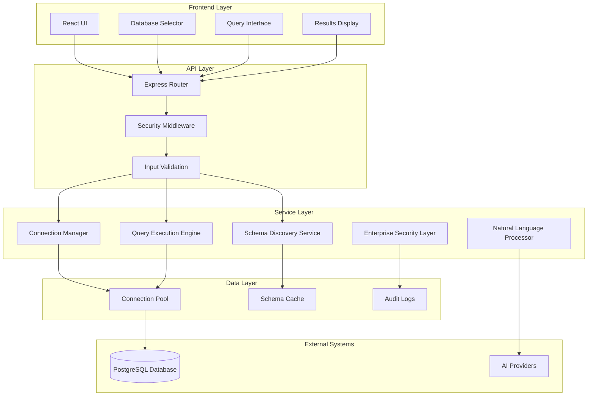
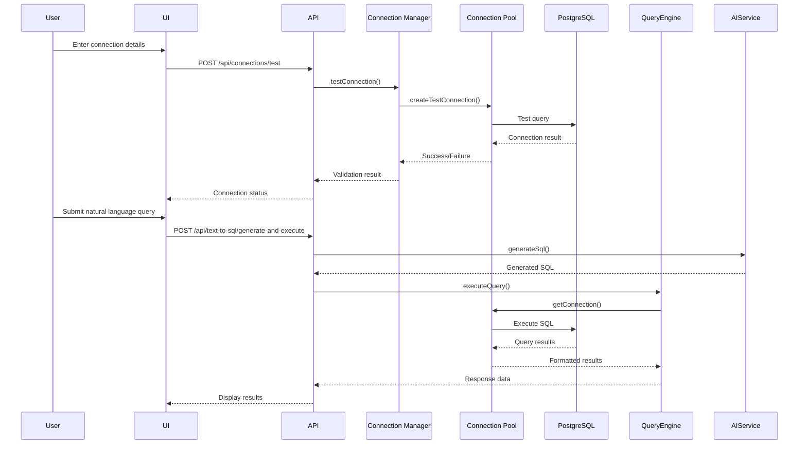

# Design Document

## Overview

This design addresses the critical database connectivity issues in the Talk to your DB application and transforms it into an enterprise-grade natural language to SQL platform. The current system has broken PostgreSQL connectivity, incomplete error handling, and lacks robust connection management. This design provides a comprehensive solution that fixes existing issues while establishing a scalable foundation for enterprise use.

The solution focuses on three core areas: **Reliable Database Connectivity**, **Robust Query Execution**, and **Enterprise-Grade Security**. The design maintains the existing natural language to SQL capabilities while significantly improving the underlying database infrastructure.

## Architecture

### High-Level Architecture



### Component Interaction Flow



## Components and Interfaces

### 1. Enhanced Database Connection Manager

**Purpose**: Manages database connections with improved reliability, connection pooling, and comprehensive error handling.

**Key Improvements**:
- Robust connection validation with detailed error reporting
- Automatic connection retry logic with exponential backoff
- Connection health monitoring and automatic recovery
- Secure credential storage with encryption
- Support for connection timeouts and resource limits

**Interface**:
```typescript
interface EnhancedConnectionManager {
  // Core connection management
  createConnection(config: DatabaseConnectionConfig): Promise<DatabaseConnection>
  testConnection(config: DatabaseConnectionConfig): Promise<ConnectionTestResult>
  getConnection(connectionId: string): Promise<ConnectionPool>
  closeConnection(connectionId: string): Promise<void>
  
  // Health monitoring
  monitorConnectionHealth(): Promise<ConnectionHealthReport>
  validateConnectionPool(): Promise<PoolValidationResult>
  
  // Error recovery
  attemptReconnection(connectionId: string): Promise<ReconnectionResult>
  handleConnectionFailure(connectionId: string, error: Error): Promise<void>
}

interface ConnectionTestResult {
  success: boolean
  connectionTime: number
  errorDetails?: {
    code: string
    message: string
    suggestions: string[]
  }
  serverInfo?: {
    version: string
    capabilities: string[]
  }
}
```

### 2. Robust Query Execution Engine

**Purpose**: Executes SQL queries with comprehensive error handling, security validation, and performance monitoring.

**Key Features**:
- SQL injection prevention through parameterized queries
- Query timeout enforcement to prevent resource exhaustion
- Comprehensive error handling with user-friendly messages
- Query performance monitoring and logging
- Result formatting and pagination support

**Interface**:
```typescript
interface QueryExecutionEngine {
  executeQuery(sql: string, connectionId: string, options?: QueryOptions): Promise<QueryResult>
  validateQuery(sql: string): Promise<QueryValidationResult>
  formatResults(rawResults: any[], options?: FormattingOptions): Promise<FormattedResults>
  
  // Performance monitoring
  getQueryPerformance(queryId: string): Promise<PerformanceMetrics>
  logSlowQuery(sql: string, executionTime: number): Promise<void>
}

interface QueryResult {
  success: boolean
  data: {
    rows: any[]
    columns: ColumnInfo[]
    rowCount: number
    executionTime: number
    queryId: string
  }
  warnings?: string[]
  performance?: PerformanceMetrics
}
```

### 3. Enhanced Schema Discovery Service

**Purpose**: Automatically discovers and caches database schema information for accurate SQL generation.

**Key Features**:
- Comprehensive table and column discovery
- Foreign key relationship mapping
- Index and constraint identification
- Schema change detection and cache invalidation
- Performance-optimized schema queries

**Interface**:
```typescript
interface SchemaDiscoveryService {
  discoverFullSchema(connectionId: string): Promise<EnhancedSchemaInfo>
  getTableInfo(connectionId: string, tableName: string): Promise<TableInfo>
  detectSchemaChanges(connectionId: string): Promise<SchemaChangeReport>
  
  // Caching
  getCachedSchema(connectionId: string): Promise<EnhancedSchemaInfo | null>
  invalidateSchemaCache(connectionId: string): Promise<void>
  refreshSchemaCache(connectionId: string): Promise<void>
}

interface EnhancedSchemaInfo {
  tables: Record<string, EnhancedTableInfo>
  relationships: ForeignKeyRelationship[]
  indexes: IndexInfo[]
  constraints: ConstraintInfo[]
  views: ViewInfo[]
  functions: FunctionInfo[]
  lastUpdated: Date
  schemaVersion: string
}
```

### 4. Enterprise Security Layer

**Purpose**: Provides comprehensive security controls for database operations and user access.

**Key Features**:
- Query validation to prevent destructive operations
- SQL injection detection and prevention
- Connection credential encryption
- Audit logging for all database operations
- Rate limiting and resource usage monitoring

**Interface**:
```typescript
interface EnterpriseSecurityLayer {
  validateQuery(sql: string): Promise<SecurityValidationResult>
  encryptCredentials(credentials: DatabaseCredentials): Promise<EncryptedCredentials>
  decryptCredentials(encrypted: EncryptedCredentials): Promise<DatabaseCredentials>
  
  // Audit and monitoring
  logDatabaseOperation(operation: DatabaseOperation): Promise<void>
  checkRateLimit(userId: string): Promise<RateLimitResult>
  monitorResourceUsage(connectionId: string): Promise<ResourceUsageReport>
}

interface SecurityValidationResult {
  isValid: boolean
  securityLevel: 'safe' | 'warning' | 'blocked'
  issues: SecurityIssue[]
  sanitizedQuery?: string
}
```

### 5. Enhanced Result Formatter

**Purpose**: Formats query results into user-friendly displays with export capabilities.

**Key Features**:
- Intelligent data type formatting (dates, numbers, currency)
- Pagination for large result sets
- Export functionality (CSV, JSON, Excel)
- Column sorting and filtering
- Responsive table display

**Interface**:
```typescript
interface ResultFormatter {
  formatResults(results: QueryResult, options?: FormattingOptions): Promise<FormattedResults>
  exportResults(results: QueryResult, format: ExportFormat): Promise<ExportedData>
  paginateResults(results: QueryResult, page: number, pageSize: number): Promise<PaginatedResults>
}

interface FormattedResults {
  columns: FormattedColumn[]
  rows: FormattedRow[]
  pagination: PaginationInfo
  summary: ResultSummary
  exportOptions: ExportOption[]
}
```

## Data Models

### Enhanced Database Connection Model

```typescript
interface DatabaseConnection {
  id: string
  name: string
  type: DatabaseType
  
  // Connection details
  host: string
  port: number
  database: string
  username: string
  encryptedPassword: string
  
  // Connection options
  ssl: boolean
  connectionTimeout: number
  queryTimeout: number
  maxConnections: number
  
  // Status and monitoring
  status: ConnectionStatus
  lastConnected: Date
  lastHealthCheck: Date
  connectionAttempts: number
  
  // Metadata
  createdAt: Date
  updatedAt: Date
  createdBy: string
  tags: string[]
}

type ConnectionStatus = 'connected' | 'disconnected' | 'error' | 'testing' | 'reconnecting'
type DatabaseType = 'postgresql' | 'mysql' | 'sqlite' | 'mssql' | 'oracle'
```

### Query Execution Model

```typescript
interface QueryExecution {
  id: string
  connectionId: string
  sql: string
  naturalLanguageQuery?: string
  
  // Execution details
  status: ExecutionStatus
  startTime: Date
  endTime?: Date
  executionTime?: number
  
  // Results
  rowCount?: number
  resultSize?: number
  errorMessage?: string
  
  // Performance
  performanceMetrics?: PerformanceMetrics
  explainPlan?: ExplainPlan
  
  // Audit
  executedBy: string
  clientInfo: ClientInfo
}

type ExecutionStatus = 'pending' | 'running' | 'completed' | 'failed' | 'cancelled'
```

### Schema Cache Model

```typescript
interface SchemaCache {
  connectionId: string
  schemaData: EnhancedSchemaInfo
  cacheKey: string
  createdAt: Date
  expiresAt: Date
  version: string
  isValid: boolean
}
```

## Error Handling

### Comprehensive Error Classification

```typescript
enum ErrorCategory {
  CONNECTION_ERROR = 'connection',
  QUERY_ERROR = 'query',
  SECURITY_ERROR = 'security',
  VALIDATION_ERROR = 'validation',
  TIMEOUT_ERROR = 'timeout',
  RESOURCE_ERROR = 'resource',
  SYSTEM_ERROR = 'system'
}

interface DatabaseError {
  category: ErrorCategory
  code: string
  message: string
  userMessage: string
  technicalDetails: string
  suggestions: string[]
  retryable: boolean
  severity: 'low' | 'medium' | 'high' | 'critical'
}
```

### Error Recovery Strategies

1. **Connection Errors**: Automatic retry with exponential backoff
2. **Query Errors**: SQL validation and suggestion system
3. **Timeout Errors**: Query optimization recommendations
4. **Resource Errors**: Connection pool management and cleanup
5. **Security Errors**: Immediate blocking with detailed audit logs

### User-Friendly Error Messages

```typescript
interface ErrorMessageMapping {
  'connection_refused': {
    userMessage: 'Unable to connect to the database. Please check if the database server is running and accessible.'
    suggestions: ['Verify host and port settings', 'Check network connectivity', 'Confirm database server status']
  }
  'invalid_credentials': {
    userMessage: 'Authentication failed. Please check your username and password.'
    suggestions: ['Verify username and password', 'Check user permissions', 'Confirm database access rights']
  }
  'query_timeout': {
    userMessage: 'Query took too long to execute. Try simplifying your request or adding filters.'
    suggestions: ['Add WHERE clauses to limit results', 'Use LIMIT to reduce result size', 'Consider breaking complex queries into smaller parts']
  }
}
```

## Testing Strategy

### Unit Testing

**Connection Manager Tests**:
- Connection establishment and validation
- Connection pool management
- Error handling and recovery
- Credential encryption/decryption

**Query Engine Tests**:
- SQL execution with various query types
- Error handling for malformed queries
- Performance monitoring accuracy
- Result formatting correctness

**Schema Discovery Tests**:
- Schema discovery accuracy
- Cache management functionality
- Change detection reliability
- Performance optimization

### Integration Testing

**Database Integration Tests**:
- End-to-end connection workflows
- Query execution across different database types
- Schema discovery with real databases
- Error scenarios with actual database errors

**API Integration Tests**:
- Complete API workflow testing
- Authentication and authorization
- Rate limiting functionality
- Error response formatting

### Performance Testing

**Load Testing**:
- Concurrent connection handling
- Query execution under load
- Connection pool efficiency
- Memory usage optimization

**Stress Testing**:
- Maximum connection limits
- Large result set handling
- Extended query execution times
- Resource exhaustion scenarios

### Security Testing

**Penetration Testing**:
- SQL injection prevention
- Authentication bypass attempts
- Credential exposure testing
- Audit log integrity

**Compliance Testing**:
- Data encryption verification
- Access control validation
- Audit trail completeness
- Privacy protection measures

## Implementation Phases

### Phase 1: Core Infrastructure (Foundation)
- Enhanced connection manager with robust error handling
- Improved connection pooling and health monitoring
- Basic security layer implementation
- Comprehensive logging system

### Phase 2: Query Engine Enhancement
- Robust query execution with timeout handling
- Advanced error classification and recovery
- Performance monitoring and optimization
- Result formatting and pagination

### Phase 3: Schema and AI Integration
- Enhanced schema discovery with caching
- Improved natural language processing
- AI provider reliability improvements
- Query suggestion system

### Phase 4: Enterprise Features
- Advanced security controls
- Audit and compliance features
- Performance analytics dashboard
- Multi-user support and permissions

This design provides a solid foundation for transforming the current application into an enterprise-grade database query platform while maintaining the innovative natural language to SQL capabilities that make it unique.