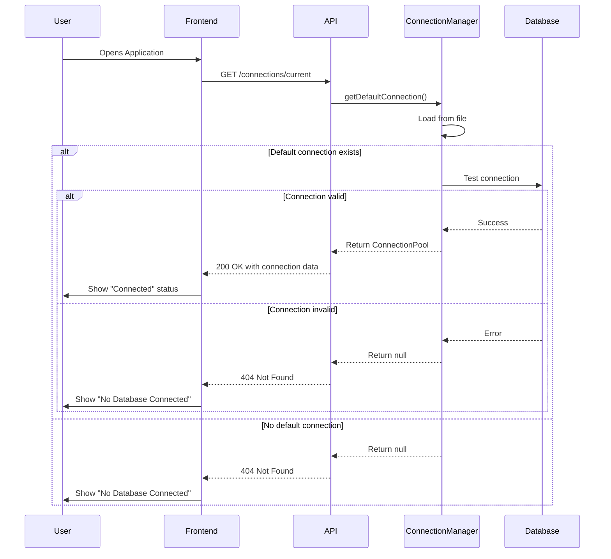
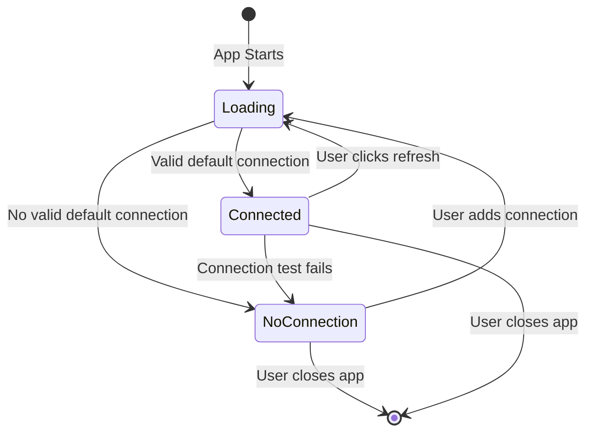

# Design Document

## Overview

This design addresses the issue where the application displays database connections as "Connected" without verifying their actual status. The solution involves adding connection validation logic to both the backend Connection Manager and the frontend application loading process. The key change is to test connections before displaying them as active, ensuring users see accurate connection status information.

## Architecture

### Current Flow (Problem)
```
1. Frontend loads → Calls GET /connections/current
2. Backend returns default connection from file (if exists)
3. Frontend displays connection as "Connected" (no verification)
4. User sees misleading "PostgreSQL Demo" connection
```

### Proposed Flow (Solution)
```
1. Frontend loads → Calls GET /connections/current
2. Backend finds default connection in file
3. Backend tests connection validity
4. If test fails → Backend returns 404 (no valid connection)
5. If test succeeds → Backend returns connection data
6. Frontend displays accurate status based on response
```

## Components and Interfaces

### Backend Changes

#### ConnectionManager Service
**File:** `backend/src/services/connectionManager.ts`

**Modified Method:** `getDefaultConnection()`

Current behavior:
- Loads default connection from file
- Returns connection without testing
- Caches connection in memory

New behavior:
- Loads default connection from file
- Tests connection before returning
- Returns null if test fails
- Logs test failures for debugging
- Does not cache invalid connections

**Method Signature:**
```typescript
async getDefaultConnection(): Promise<ConnectionPool | null>
```

**Implementation Logic:**
1. Read connections from file
2. Find connection with `isDefault: true`
3. If found, test the connection using `testConnection()`
4. If test succeeds, create pool and return ConnectionPool
5. If test fails, log error and return null
6. If no default found, return null

#### Connections Route
**File:** `backend/src/routes/connections.ts`

**Modified Endpoint:** `GET /connections/current`

Current behavior:
- Calls `getDefaultConnection()`
- Returns connection data or 404

New behavior:
- Calls `getDefaultConnection()` (which now includes testing)
- Returns 404 if no valid default connection exists
- Returns connection data only for verified connections

No changes needed to this endpoint - it already handles null responses correctly.

### Frontend Changes

#### App Component
**File:** `frontend/src/App.tsx`

**Modified Method:** `loadCurrentDatabase()`

Current behavior:
- Calls `/connections/current`
- Sets connection as "Connected" if data returned
- Shows loading state during fetch

New behavior:
- Calls `/connections/current`
- Handles 404 response gracefully (no error display)
- Only sets connection as "Connected" if backend returns valid data
- Logs connection failures to console for debugging
- Shows "No Database Connected" state when no valid connection exists

**Implementation Logic:**
```typescript
const loadCurrentDatabase = async () => {
  setConnectionLoading(true)
  try {
    const response = await api.get('/connections/current')
    if (response.data.success && response.data.data) {
      // Backend has verified connection - safe to display as connected
      setCurrentDatabase({
        ...response.data.data,
        isConnected: true,
        lastConnected: new Date().toISOString()
      })
      return
    }
  } catch (error) {
    // 404 or connection test failed - this is expected behavior
    console.log('No valid database connection found:', error)
  } finally {
    setConnectionLoading(false)
  }
  
  // No valid connection - show disconnected state
  setCurrentDatabase(null)
}
```

#### Connection Refresh
**File:** `frontend/src/App.tsx`

**Modified Method:** `refreshConnection()`

Current behavior:
- Calls `loadCurrentDatabase()`
- Shows loading indicator

New behavior:
- Same as current (no changes needed)
- The underlying `loadCurrentDatabase()` now includes validation

## Data Models

### ConnectionPool (Backend)
```typescript
interface ConnectionPool {
  id: string;
  type: DatabaseConnection['type'];
  pool: any; // Database-specific pool object
  connection: DatabaseConnection;
}
```

### DatabaseConnection (Shared)
```typescript
interface DatabaseConnection {
  id: string;
  name: string;
  type: string;
  database: string;
  host?: string;
  port?: number;
  isDefault: boolean;
  createdAt: Date;
  updatedAt: Date;
  // ... other database-specific fields
}
```

## Error Handling

### Backend Error Scenarios

1. **Connection Test Timeout**
   - Scenario: Database is unreachable
   - Handling: Catch timeout error, log details, return null
   - User Impact: Sees "No Database Connected"

2. **Invalid Credentials**
   - Scenario: Stored credentials are incorrect
   - Handling: Catch authentication error, log details, return null
   - User Impact: Sees "No Database Connected"

3. **Database Not Running**
   - Scenario: Database service is stopped
   - Handling: Catch connection error, log details, return null
   - User Impact: Sees "No Database Connected"

4. **Missing Connections File**
   - Scenario: First-time deployment
   - Handling: Already handled - creates empty file
   - User Impact: Sees "No Database Connected"

### Frontend Error Scenarios

1. **API Call Fails**
   - Scenario: Backend is unreachable
   - Handling: Catch error, log to console, show disconnected state
   - User Impact: Sees "No Database Connected"

2. **404 Response**
   - Scenario: No valid default connection
   - Handling: Treat as expected behavior, no error message
   - User Impact: Sees "No Database Connected"

3. **Network Timeout**
   - Scenario: Slow network connection
   - Handling: Catch timeout, log to console, show disconnected state
   - User Impact: Sees "No Database Connected" after loading

### Error Logging Strategy

- Backend: Log all connection test failures with connection details (excluding passwords)
- Frontend: Log connection loading failures to console (development only)
- No user-facing error messages on initial load (expected behavior)
- User-facing errors only when user explicitly tries to connect

## Testing Strategy

### Unit Tests

1. **ConnectionManager.getDefaultConnection()**
   - Test: Returns null when no default connection exists
   - Test: Returns null when connection test fails
   - Test: Returns ConnectionPool when connection test succeeds
   - Test: Handles missing connections file gracefully

2. **Frontend loadCurrentDatabase()**
   - Test: Sets currentDatabase to null when API returns 404
   - Test: Sets currentDatabase when API returns valid connection
   - Test: Handles API errors gracefully
   - Test: Shows loading state during fetch

### Integration Tests

1. **End-to-End Connection Flow**
   - Test: Fresh deployment with no connections shows "No Database Connected"
   - Test: Invalid default connection shows "No Database Connected"
   - Test: Valid default connection shows "Connected" status
   - Test: Refresh button re-tests connection

2. **Connection State Transitions**
   - Test: Disconnected → Connected (after adding valid connection)
   - Test: Connected → Disconnected (after database stops)
   - Test: Disconnected → Disconnected (refresh with no database)

### Manual Testing Scenarios

1. **Fresh Deployment**
   - Delete connections.json file
   - Start application
   - Verify "No Database Connected" is shown
   - Verify no errors in console

2. **Invalid Connection**
   - Add connection with wrong credentials to connections.json
   - Set as default
   - Restart application
   - Verify "No Database Connected" is shown
   - Verify error is logged in backend console

3. **Valid Connection**
   - Add connection with correct credentials
   - Set as default
   - Restart application
   - Verify connection shows as "Connected"
   - Verify database details are displayed

4. **Connection Refresh**
   - Start with valid connection
   - Stop database service
   - Click refresh button
   - Verify status changes to "No Database Connected"

## Implementation Notes

### Performance Considerations

- Connection testing adds latency to initial page load (typically 100-500ms)
- This is acceptable as it ensures accurate status display
- Connection test timeout should be set to 2 seconds (already configured)
- Failed connection tests should not block application loading

### Backward Compatibility

- Existing connections in connections.json will continue to work
- No database schema changes required
- No API contract changes (same endpoints, same response format)
- Frontend gracefully handles both old and new backend behavior

### Deployment Considerations

1. **Clean Slate Deployment**
   - Remove or clear connections.json file before deployment
   - Application will start with no connections
   - Users must explicitly add their database connections

2. **Migration from Existing Deployment**
   - Existing connections will be tested on first load
   - Invalid connections will be ignored (not deleted)
   - Users can manually delete invalid connections from UI

### Security Considerations

- Connection test failures should not expose sensitive information
- Error logs should not include passwords
- Frontend should not display detailed error messages (prevents information leakage)
- Connection credentials remain encrypted in transit (HTTPS)

## Alternative Approaches Considered

### Alternative 1: Remove Default Connection on Test Failure
**Approach:** Automatically delete invalid default connections from file

**Pros:**
- Cleaner data state
- Prevents repeated test failures

**Cons:**
- Destructive operation (data loss)
- User loses connection configuration
- Harder to debug connection issues

**Decision:** Rejected - too destructive

### Alternative 2: Add Connection Status Field to Database
**Approach:** Store connection status in database and update periodically

**Pros:**
- Faster initial load (no testing required)
- Can show historical connection status

**Cons:**
- Adds complexity (background job, database schema)
- Status can become stale
- Overkill for current requirements

**Decision:** Rejected - too complex for current needs

### Alternative 3: Test Connection in Frontend
**Approach:** Frontend calls test endpoint before displaying connection

**Pros:**
- Backend remains simple
- Frontend has full control

**Cons:**
- Extra API call (slower)
- Duplicates testing logic
- Harder to maintain

**Decision:** Rejected - backend is better place for validation

## Diagrams

### Connection Validation Flow



### State Diagram


